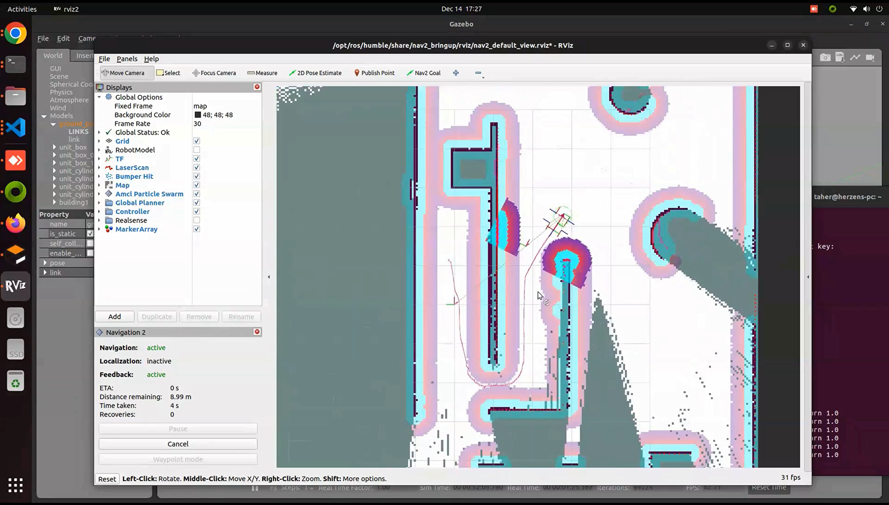
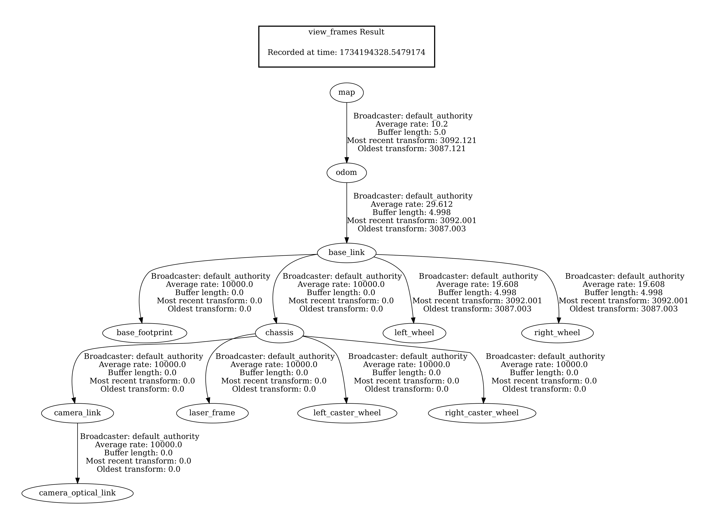

# ROS2 SLAM Autonomous Navigation with SLAM Toolbox and Nav2

Use the SLAM Toolbox to generate a map of the environment, then utilize the Nav2 stack for autonomous navigation within that mapped space. Rviz provides visualization of the robot, its surroundings, and ongoing navigation tasks.

## Demo Video
[](https://youtu.be/-g2nmHqZfgc?si=NTKtegcQCZkt2e99)


## Overview

This project provides:
- **Gazebo** simulation environment.
- **ROS2** Control integration to handle the robot’s joints and controllers.
- **SLAM Toolbox** for online (asynchronous) map building as the robot explores.
- **Nav2** stack to plan paths and autonomously navigate in the mapped environment.
- **Rviz2** visualization for monitoring robot state, the map, and navigation plans.

## Transform frame



## Dependencies and Setup

-  Install ROS 2 Humble - [Read here](https://docs.ros.org/en/humble/Installation.html)
-  Create Workspace - [Read here](https://docs.ros.org/en/humble/Tutorials/Beginner-Client-Libraries/Creating-A-Workspace/Creating-A-Workspace.html)
-  Install XACRO 
```sh
sudo apt install ros-<distro-name>-xacro 
```
- Gazebo ROS Packages
```sh
sudo apt install ros-<distro-name>-gazebo-ros-pkgs
```
- ROS2 Control
```sh
sudo apt install ros-<distro-name>-ros2-control ros-<distro-name>-ros2-controllers ros-<distro-name>-gazebo-ros2-control
```
- SLAM Toolbox
```sh
sudo apt install ros-<distro-name>-slam-toolbox
```
- Nav2 and Twist Mux 
```sh
sudo apt install ros-<distro-name>-navigation2 sudo apt install ros-<distro-name>-nav2-bringup sudo apt install ros-<distro-name>-twist-mux
```

## Building the Package
After cloning this repository into your workspace’s ```src``` directory:
```sh
cd <your_ros2_ws>
colcon build
source install/setup.bash
```

## Usage

1. **Launch the Simulation**
Run the Gazebo simulation environment and spawn the robot:

```sh
ros2 launch ros2_slam_auto_navigation launch_sim.launch.py world_file:=/home/taher/ros2_ws/src/ros2-slam-auto-navigation/worlds/simple.world
```

2. **Launch SLAM and Navigation**
In a new terminal (with the workspace sourced), launch the SLAM Toolbox and Nav2 bringup with Rviz:
```sh
ros2 launch ros2_slam_auto_navigation slam_navigation.launch.py slam_params_file:=/home/taher/ros2_ws/src/ros2-slam-auto-navigation/config/mapper_params_online_async.yaml use_sim_time:=true
```

3. **Use Rviz2 for Visualization:** Rviz2 should start automatically from the second launch file. In Rviz2:
   - You can visualize the robot’s pose, sensors, and the map being built.
   - Interactively set navigation goals using the "2D Nav Goal" tool once the map and localization are stable.

4. **Autonomous Navigation:** Once you have a map (even partial), you can send navigation goals to the robot via Rviz. Nav2 will compute a path and command the robot to reach the desired destination.

## Launch Simulator-SLAM-Navigation-RViz commands individually

1. Launching the Simulation Environment
```sh
ros2 launch ros2_slam_auto_navigation launch_sim.launch.py world_file:=/home/taher/ros2_ws/src/ros2-slam-auto-navigation/worlds/simple.world
```
2. Starting the SLAM Toolbox (Online, Asynchronous Mode)
```sh
ros2 launch slam_toolbox online_async_launch.py slam_params_file:=/home/taher/ros2_ws/src/ros2-slam-auto-navigation/config/mapper_params_online_async.yaml use_sim_time:=true
```
3. Initializing the Navigation Stack
```sh
ros2 launch nav2_bringup navigation_launch.py use_sim_time:=True
```
4. Opening RViz with Navigation Visualization
```sh
ros2 run rviz2 rviz2 use_sim_time:=True -d /opt/ros/humble/share/nav2_bringup/rviz/nav2_default_view.rviz
```

## Troubleshooting
- **Simulation Issues:**
  Ensure that Gazebo, ROS2 Control, and joint publisher packages are correctly installed.

- **TF or Robot Description Issues:**
Check the URDF/Xacro files and the rsp.launch.py to ensure the robot description is being published correctly.

- **Navigation Errors:**
Confirm that SLAM Toolbox is running and providing a map. Ensure that Nav2 parameters match your robot’s configuration (e.g., footprint, sensor sources).

## Contributing
Contributions are welcome. If you find a bug or have a feature request, please open an issue or submit a pull request.

## Resources

- Robot Operating System [(ROS 2 Humble)](https://docs.ros.org/en/humble/index.html)
- ROS 2 [tf2](https://docs.ros.org/en/humble/Tutorials/Intermediate/Tf2/Introduction-To-Tf2.html)
- [ROS 2 Navigation](https://github.com/ros-navigation/navigation2/) Framework and System
- [Slam Toolbox](https://github.com/SteveMacenski/slam_toolbox) for lifelong mapping and localization in potentially massive maps with ROS
